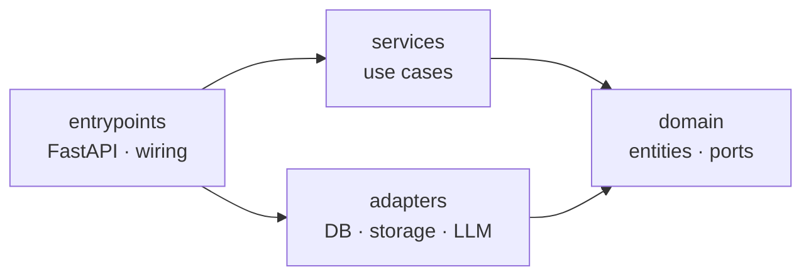

# PageMaster

PageMaster turns documents — PDF uploads or web articles — into AI-generated
summaries you actually read: per-chapter for a book, a single summary for an
article. Built on top: chat over a document, and a podcast for articles.

> **This repository is a portfolio piece.** The app is real and useful, but the
> primary goal is to demonstrate engineering practice: clean **Domain-Driven Design
> + Hexagonal (ports-and-adapters) architecture**, developed **strictly test-first**,
> with every significant decision captured as an **ADR**. It is **self-contained** by
> design — the target is `git clone` → `docker compose up` with zero external
> services. The git history is part of the artifact: a clean red→green TDD trail.

## What this repo is meant to demonstrate

- **Hexagonal / DDD layering** with dependencies pointing strictly inward, and an
  **architecture fitness function** (`import-linter`) that **fails CI** if a layer
  imports the wrong way — the rule is executable, not just documented.
- **Persistence ignorance** — the domain model has zero ORM imports; it is mapped to
  Postgres by SQLAlchemy *imperative mapping* declared entirely in the adapter layer.
- **The full test pyramid** — fast unit and API tests with in-memory fakes, plus
  **integration tests against real Postgres** in throwaway containers (testcontainers).
- **Architecture Decision Records** ([`docs/adr/`](docs/adr/)) — the *why* behind each
  choice, **including what was deliberately deferred or kept simple**. Judgment and
  restraint are the point as much as the patterns themselves.
- **A living architecture map** ([`docs/architecture.md`](docs/architecture.md)) with
  diagrams that render on GitHub, kept in step with the code.
- **Incremental TDD** — each capability lands as a 🔴 failing-test → 🟢 implementation
  commit pair, visible in `git log`.

## Architecture

Ports-and-adapters under `src/pagemaster/`, dependencies pointing inward only.
`services` and `adapters` are independent siblings; composition happens in
`entrypoints`.



- **`domain/`** — entities, value objects, and ports; pure Python, no framework or I/O.
- **`services/`** — application use cases, framework-agnostic, dependencies injected.
- **`adapters/`** — concrete implementations of domain ports (Postgres, object storage, …).
- **`entrypoints/`** — the FastAPI app, routes, and dependency wiring.

Layers and structure **materialize just-in-time**, as the capability that needs them
arrives — never speculatively. See [`docs/architecture.md`](docs/architecture.md) for
the full map and [`docs/adr/`](docs/adr/) for the decisions behind it.

## Status

Work in progress, built batch by batch. Implemented so far:

- `GET /health` and the app + CI spine.
- The `Document` aggregate — generated id, validated title, guarded status lifecycle.
- Persistence **ports** (`DocumentRepository`, `UnitOfWork`) with two implementations:
  an in-memory fake and a **Postgres adapter** proven against a real database.
- Use cases (`services/`): `UploadDocument` (file-first over an object-storage port),
  `ListDocuments`, `DeleteDocument`, `ExtractDocument` (PDF → Markdown).
- HTTP API: `POST` / `GET` / `DELETE /api/documents`.
- A **composition root** that runs the app for real — environment-driven settings,
  an engine lifespan, and startup provisioning of the schema + bucket — so
  **`docker compose up` runs the whole stack** (api + Postgres + MinIO) end to end.

Planned: PDF chapter navigation, URL ingest, AI summaries (mock by default, any
OpenAI-compatible endpoint pluggable), chat, podcast, two React frontends (admin +
reader), and end-to-end tests. See the roadmap in
[`docs/architecture.md`](docs/architecture.md).

## Tech stack

Python 3.12 · FastAPI · SQLAlchemy 2 (async) · PostgreSQL · MinIO (S3) · `uv` ·
pytest · import-linter · testcontainers · Docker Compose. React frontends to come.

## Requirements

- Docker (to run the stack, and for the integration tests)
- Python 3.12 and [uv](https://docs.astral.sh/uv/) (to develop / run the fast suite)

## Run it

```bash
make up            # docker compose up — api + Postgres + MinIO, end to end
curl http://localhost:8000/health                       # {"status": "ok"}
curl -F title='Clean Code' -F file=@some.pdf \
     http://localhost:8000/api/documents                # upload a document
curl http://localhost:8000/api/documents                # list them
make down          # stop the stack and remove its volumes
```

The api provisions its own schema and bucket on startup, so the stack needs no setup
step — `git clone` → `make up` and it runs. Every value defaults; copy
[`.env.example`](.env.example) to `.env` only to override.

## Development

```bash
make sync          # install dependencies
make lint          # check the hexagonal layering (import-linter)
make test          # fast suite — unit + API, no Docker
make integration   # integration tests against real Postgres + MinIO (needs Docker)
make dev           # run the app on the host (needs Postgres + MinIO; see .env.example)
```

## License

[MIT](LICENSE)
