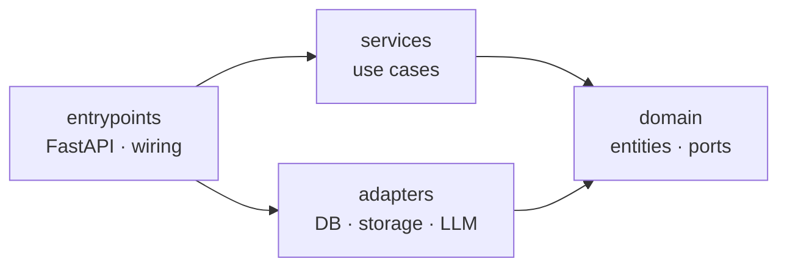

# Cicero

Cicero turns documents — PDF uploads or web articles — into AI-generated
summaries you actually read: per-chapter for a book, a single summary for an
article. Planned on top: chat over a document, and a podcast for articles.

> **This repository is a portfolio piece.** The app is real and useful, but the
> primary goal is to demonstrate engineering practice: clean **Domain-Driven Design
> plus Hexagonal (ports-and-adapters) architecture**, developed **strictly test-first**,
> with every significant decision captured as an **ADR**. It is **self-contained** by
> design — the target is `git clone` → `docker compose up` with zero external
> services. The git history is part of the artifact: a clean red→green TDD trail.

## What this repo is meant to demonstrate

- **Hexagonal / DDD layering** with dependencies pointing strictly inward, and an
  **architecture fitness function** (`import-linter`) that **fails CI** if a layer
  imports the wrong way — the rule is executable, not just documented.
- **Persistence ignorance** — the domain model has zero ORM imports; it is mapped to
  Postgres by SQLAlchemy *imperative mapping* declared entirely in the adapter layer.
- **Domain events and a message bus** — aggregates record events off their own
  lifecycle, and one `bus.handle()` routes commands (exactly one handler) and events
  (zero or more), so new reactions are added by *subscribing*, not by editing the
  caller. Introduced where the processing pipeline needs it, not speculatively.
- **The full test pyramid** — fast unit and API tests with in-memory fakes,
  **integration tests against real Postgres and MinIO** in throwaway containers
  (testcontainers), and **black-box Playwright E2E** through the compose stack — all
  gated in CI.
- **Architecture Decision Records** ([`docs/adr/`](docs/adr/)) — the *why* behind each
  choice, **including what was deliberately deferred or kept simple**. Judgment and
  restraint are the point as much as the patterns themselves.
- **A living architecture map** ([`docs/architecture.md`](docs/architecture.md)) with
  diagrams that render on GitHub, kept in step with the code.
- **Incremental TDD** — each capability lands as a 🔴 failing-test → 🟢 implementation
  commit pair, visible in `git log`.

## Architecture

Ports-and-adapters under `src/cicero/`, dependencies pointing inward only.
`services` and `adapters` are independent siblings; composition happens in
`entrypoints`.



- **`domain/`** — entities, value objects, and ports; pure Python, no framework or I/O.
- **`services/`** — application use cases, framework-agnostic, dependencies injected.
- **`adapters/`** — concrete implementations of domain ports (Postgres, object storage, …).
- **`entrypoints/`** — the FastAPI app, routes, and dependency wiring.

Layers and structure **materialize just-in-time**, as the capability that needs them
arrives — never speculatively. See [`docs/architecture.md`](docs/architecture.md) for
the full map and [`docs/adr/`](docs/adr/) for the decisions behind it.

## Status

Work in progress, built incrementally and test-first — but already a running,
end-to-end app, not a scaffold. Implemented so far:

- **The document pipeline, end to end.** Upload a PDF or ingest a web article by URL,
  and it flows through extraction → chapterization → AI summarization as a chain of
  **domain-event handlers** on an in-process job queue (serial, with restart recovery).
- **AI summaries** — per-chapter for a book, a single summary for an article — with a
  **mock adapter as the zero-config default** and a pluggable **OpenAI-compatible**
  endpoint. Oversized chapters are handled by a map-reduce chunker.
- **Chapter navigation** rebuilt from the PDF's table of contents, with a no-TOC
  fallback; each chapter carries its own summary.
- **Enrichment** (best-effort, never gates readability): cover render + author/year
  inference, again mock-by-default with an OpenAI-compatible option.
- **Two React frontends**, split by role: a **reader** (library grid with a
  Books | Articles switch; a document page with TOC + per-chapter summaries) and an
  **admin console** (upload, URL ingest, status polling, delete, inspect extracted
  Markdown, view the original PDF).
- **A CQRS read side** — reads bypass the bus through a query/`views` module, with a
  denormalized per-chapter read model.
- **Clean architecture, enforced:** hexagonal layering with an `import-linter` fitness
  function in CI, a persistence-ignorant domain (imperative SQLAlchemy mapping), a
  message bus, domain exceptions mapped to HTTP at the edge, and **Alembic migrations**.
- **HTTP API:** documents CRUD + `/url` ingest, `/summary`, `/chapters`, `/content`,
  and the original `/file`.
- **The full test pyramid**, all gated in CI: fast unit + API tests with in-memory
  fakes, integration tests against real Postgres + MinIO (testcontainers), and
  **black-box Playwright E2E** through the compose stack.
- **Self-contained:** `git clone` → `docker compose up` runs the whole stack
  (api + Postgres + MinIO); the api runs its own migrations and provisions its bucket
  on startup.

Planned next: podcast (articles), chat over a document with typed SSE streaming,
embedding RAG, library-wide chat, notes, and library organisation. See the roadmap in
[`docs/architecture.md`](docs/architecture.md).

## Tech stack

Python 3.12 · FastAPI · SQLAlchemy 2 (async) · Alembic · PostgreSQL · MinIO (S3) ·
`uv` · pytest · import-linter · testcontainers · React · Vite · Vitest · Playwright ·
Docker Compose.

## Requirements

- Docker (to run the stack, and for the integration tests)
- Python 3.12 and [uv](https://docs.astral.sh/uv/) (to develop / run the fast suite)
- Node.js 20+ (CI uses 22) — only for the frontend and the E2E suite

## Run it

```bash
make up            # docker compose up — api + Postgres + MinIO, end to end
curl http://localhost:8000/health                       # {"status": "ok"}
curl -F title='Clean Code' -F file=@some.pdf \
     http://localhost:8000/api/documents                # upload a document
curl http://localhost:8000/api/documents                # list them
make down          # stop the stack and remove its volumes
```

The api migrates its own schema (`alembic upgrade head`) and ensures its bucket on
startup, so the stack needs no setup step — `git clone` → `make up` and it runs. Every
value defaults; copy [`.env.example`](.env.example) to `.env` only to override.

## Development

```bash
make sync          # install dependencies
make lint          # check the hexagonal layering (import-linter)
make test          # fast suite — unit + API, no Docker
make integration   # integration tests against real Postgres + MinIO (needs Docker)
make e2e           # black-box Playwright E2E through the compose stack (needs Docker + Node)
make dev           # run the app on the host (needs Postgres + MinIO; see .env.example)
```

## License

[MIT](LICENSE)
