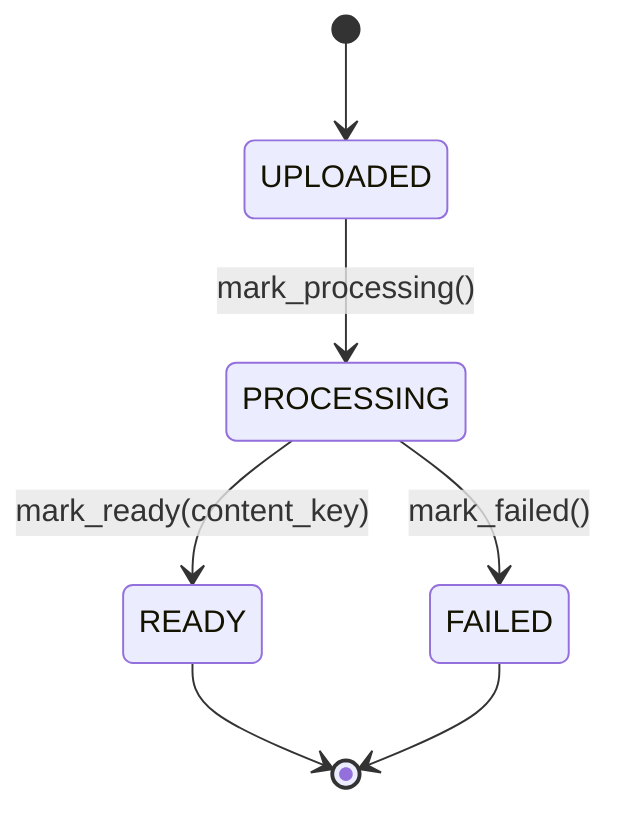

# ADR-002: Document Status as a Guarded State Machine

**Status:** Accepted

> Builds on [ADR-001](001-hexagonal-ddd-layering.md): the state machine lives
> entirely in the `Document` aggregate root, with no infrastructure deps.

---

## Context

A document moves through a fixed lifecycle — created, extracted, then readable or
failed — and order matters: it cannot be READY before extraction runs. Exposing
`status` as a freely assignable field would let any layer set any status without
the entity knowing, and would push the "READY implies a content key exists"
invariant outside the entity that owns it. Since `Document` is the aggregate root
(ADR-001), it should own these rules.

---

## Decision

Model the lifecycle as a `DocumentStatus` enum, mutated only through methods on
`Document` — there is no public `status` setter:

A new document starts `UPLOADED`. `mark_ready(content_key)` flips the status
**and** sets `content_key` in one call. There are no reverse transitions
(re-extraction is not supported).

`content_key` is an **opaque locator for the extracted text** — internal raw
material for summaries, never shown to the reader. The domain holds it as a plain
string and deliberately does not know the text's format, location, or how it is
produced; those are separate ADRs (extraction, storage, summarization). Keeping
it opaque is what lets the domain stay infrastructure-agnostic (ADR-001).

---

## Consequences

- `mark_ready()` makes "READY ⇒ `content_key` set" atomic, so there is never a
  READY document with a null key. Valid states live in one enum; an unknown
  status string fails to deserialise rather than flowing through silently.
- Transitions are self-documenting — a new one needs a deliberate new method.
- The methods don't guard call *order* (e.g. `mark_ready()` twice); the guard is
  encapsulation, not runtime checks, and the method is the place to add one if
  ever needed.
- Re-extraction (retry from FAILED) is unsupported for now; when the project needs
  it, this ADR is revisited and the transition added deliberately.
