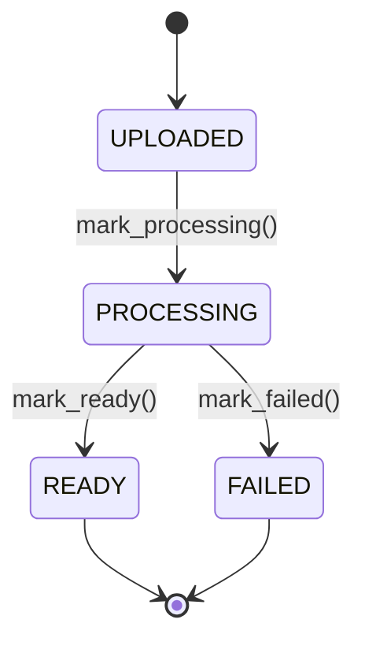

# ADR-002: Document Status as a Guarded State Machine

**Status:** Accepted

> Builds on [ADR-001](001-hexagonal-ddd-layering.md): the state machine lives
> entirely in the `Document` aggregate root, with no infrastructure deps.

---

## Context

A document moves through a fixed lifecycle — created, extracted, then readable or
failed — and order matters: it cannot be READY before extraction runs. Exposing
`status` as a freely assignable field would let any layer set any status without
the entity knowing, and would push the "READY implies a content key exists"
invariant outside the entity that owns it. Since `Document` is the aggregate root
(ADR-001), it should own these rules.

---

## Decision

Model the lifecycle as a `DocumentStatus` enum, mutated only through methods on
`Document` — there is no public `status` setter:

A new document starts `UPLOADED`; the `mark_*` methods are the only way to move
it. There are no reverse transitions (re-extraction is not supported).

`status` is the single source of truth for **readiness**: the extracted text
exists when (and only when) the status is READY. `content_key` is not lifecycle
state — it is the **identity-derived address** of that text, always computable
from the id, opaque to the domain (which knows neither its format nor where it
physically lives). Folding the locator into a nullable
field would duplicate what `status` already says; deriving the address and reading
readiness off `status` keeps one fact in one place.

---

## Consequences

- "READY ⇔ extracted text exists" is structural, not a maintained invariant:
  readiness is `status` alone, and the address is derived, so the two can never
  disagree (no nullable key to forget to set). Valid states live in one enum; an
  unknown status string fails to deserialise rather than flowing through silently.
- Transitions are self-documenting — a new one needs a deliberate new method.
- The methods don't guard call *order* (e.g. `mark_ready()` twice); the guard is
  encapsulation, not runtime checks, and the method is the place to add one if
  ever needed.
- Re-extraction (retry from FAILED) is unsupported for now; when the project needs
  it, this ADR is revisited and the transition added deliberately.
