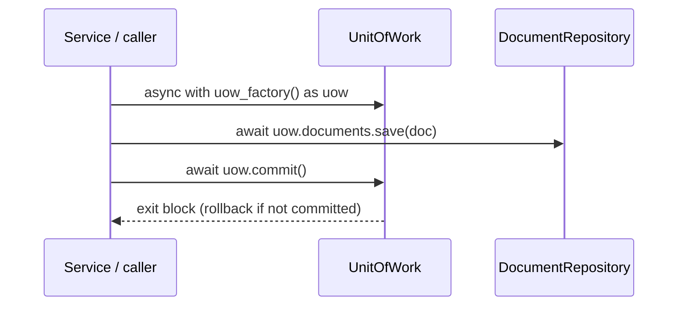

# ADR-003: Unit of Work and Repository Ports

**Status:** Accepted

> Builds on [ADR-001](001-hexagonal-ddd-layering.md): the ports defined here live
> in `domain/`; the adapters that implement them sit in the outer layers and
> depend inward, never the reverse.

---

## Context

To do anything useful the app must **save and fetch** documents — and soon do so
across several aggregates (notes, chat, collections) that change together and
must commit or fail together. Two questions precede any persistence code:

1. **Who owns the transaction boundary?** Heavy flows read and write repeatedly;
   if each write committed on its own, a mid-flow failure would leave a
   half-updated database.
2. **How do services persist without depending on a database?** The domain and
   services stay infrastructure-agnostic (ADR-001), so they need a *port* — an
   abstract interface the domain owns and an outer adapter implements.

Handing services a live session or a global repository would couple every use
case to a concrete database and scatter transaction control across call sites —
the hidden global state ADR-001 exists to prevent.

---

## Decision

Two domain ports, each at the layer its scope belongs to:

- **`DocumentRepository`** (`domain/document/ports/`) — the collection for the
  `Document` *aggregate* (`save`, `find_by_id`; more just-in-time). Per-aggregate,
  so prefixed and under the aggregate.
- **`UnitOfWork`** (`domain/ports/`) — the **transaction scope** (unprefixed, at
  the domain root). An async context manager exposing one repository per aggregate
  (`uow.documents`, later `uow.notes` / …), so one block commits across several
  aggregates atomically.

**One `async with` block is one transaction. Commit is explicit; any other exit —
a forgotten commit or an exception — rolls back.** Repositories are reached
through the UoW, never constructed directly. **Services receive a `uow_factory`**
— a zero-arg callable returning a fresh, unentered UoW — not a single instance, so
one use case can open several sequential transactions (dependencies are
constructor parameters, ADR-001).

This batch ships only an **in-memory** implementation (a test double that buffers
writes and flushes on commit); a real Postgres adapter lands later behind the same
ports, with the behaviour re-verified unchanged. Until then there is no
`adapters/` layer, so the import-linter contract is not yet extended.

---

## Consequences

- Transaction scope is owned in one place — the `async with` block — so a flow
  that raises leaves nothing half-committed, and the database is a swappable
  adapter verified the same way in-memory and against Postgres.
- Cross-aggregate atomic commit is possible without reshaping the interface, but
  is not yet exercised (only `Document` exists); the test arrives with the second
  aggregate.
- The cost is indirection (a port, a UoW, a factory) and that callers must
  remember to `commit()` — the UoW rolls back by default, so a forgotten commit
  silently discards writes. Tests pin "no commit ⇒ nothing persisted" so the rule
  is visible rather than surprising.
