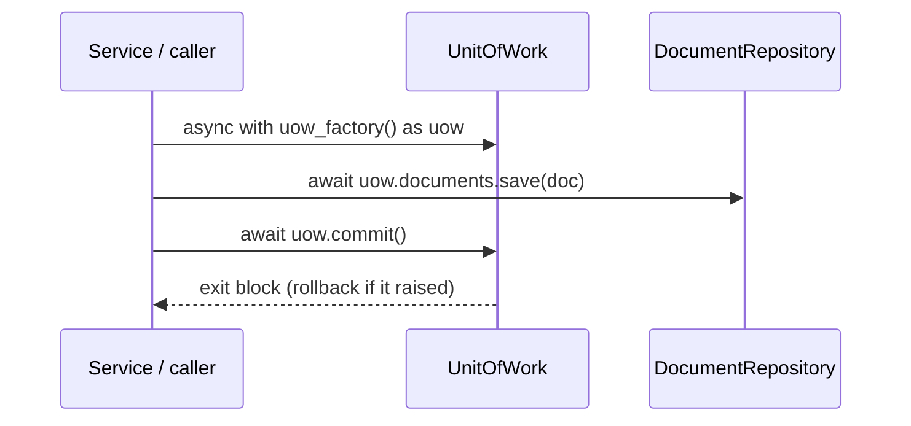

# ADR-003: Unit of Work and Repository Ports

**Status:** Accepted

> Builds on the hexagonal layering of [ADR-001](001-hexagonal-ddd-layering.md):
> the ports defined here live in `domain/`, and the adapters that implement them
> (in-memory now, Postgres in a later batch) sit in the outer layers and depend
> inward on these interfaces, never the reverse.

---

## Context

The domain so far is a pure `Document` aggregate ([ADR-001](001-hexagonal-ddd-layering.md), [ADR-002](002-document-status-state-machine.md)).
To do anything useful the application must **save and fetch** documents — and,
soon, do so across more than one aggregate (notes, chat sessions, collections)
that change together and must commit or fail together.

Two questions have to be answered before any persistence code is written:

1. **Who owns the transaction boundary?** Heavy flows (extract → summarise →
   podcast) read and write repeatedly. If each read/write committed on its own,
   a failure mid-flow would leave the database in a half-updated state. The unit
   of consistency is the aggregate, and a use case must be able to say "these
   changes happen together, or not at all."
2. **How do services reach storage without depending on a database?** The domain
   and services must stay infrastructure-agnostic (ADR-001), yet still persist.
   They need a *port* — an abstract interface owned by the domain — that an outer
   adapter implements.

The naive alternative is to hand services a live database session (or a global
repository singleton) and let them call it directly. That couples every use case
to a concrete database, scatters transaction control across call sites, and
makes hidden global state — the exact things ADR-001's layering exists to
prevent.

---

## Decision

Introduce two domain ports, each at the layer its scope belongs to:

- **`DocumentRepository`** (`domain/document/ports/`) — the persistence
  operations for the `Document` *aggregate* (`save`, `find_by_id`; `find_all`
  and `delete` are added in the batches that need them). It is a collection-like
  interface, *not* a database session. Per-aggregate, so it is prefixed and
  lives under the aggregate.
- **`UnitOfWork`** (`domain/ports/`) — the **transaction boundary**. It is the
  transaction *scope*, not an aggregate's collection, so it is unprefixed and
  lives at the domain root rather than under `document/`. It is an async context
  manager that exposes one repository per aggregate as an attribute
  (`uow.documents`, and later `uow.notes`, `uow.chat`, …) and offers
  `commit()` / `rollback()`.

**One `async with uow_factory() as uow:` block is one transaction.** Commit is
explicit and rollback is the default: on normal exit after `commit()` the
changes are durable; on any other exit — the block forgot to commit, or it
raised — the Unit of Work rolls back. Repositories are reached *through* the
Unit of Work (`uow.documents.save(...)`), never constructed directly by callers.

**Repository per aggregate.** Persistence verbs hang off a named repository per
aggregate (`uow.documents.save`) rather than being flattened onto the Unit of
Work itself (`uow.save`). The Unit of Work owns *transaction* concerns
(`commit`, `rollback`, enter/exit); each repository owns *one aggregate's*
storage. This keeps the two roles separate and lets a single transaction span
several aggregates that change together — `uow.documents` **and** `uow.notes` in
one block — without the Unit of Work growing a flat soup of
`save_document` / `save_note` / `find_chat_session` methods.

**Services receive a `uow_factory`, not a Unit of Work.**
`UnitOfWorkFactory` is a zero-argument callable returning a *fresh,
unentered* Unit of Work. Passing the factory (not a single instance) lets one
use case open several sequential transactions — e.g. a background job that needs
the upload transaction to commit before its first read. Dependencies are
constructor parameters, never globals (ADR-001).

**Adapters are introduced just in time.** This batch ships only an **in-memory**
implementation of the ports, used as a test double: it buffers writes per
transaction and flushes them to a shared store on `commit`, so uncommitted work
is invisible to other transactions. A real Postgres adapter is added in a later
batch behind the *same* ports; the save-and-fetch behaviour the unit tests pin
down here is re-run against it unchanged. Until that adapter exists there is no
`adapters/` layer, so the import-linter contract is not yet extended.

---

## Consequences

**Benefits:**

- Transaction scope is owned in exactly one place — the `async with` block — not
  scattered across repository calls. A flow that raises leaves nothing
  half-committed.
- The domain and services depend only on abstract ports, so they stay
  infrastructure-agnostic: the database is a swappable adapter (in-memory today,
  Postgres tomorrow) and behaviour is verified the same way against both.
- Multiple aggregates can be committed atomically through one Unit of Work
  without reshaping the interface. This is *forward-looking*: with only the
  `Document` aggregate today there is nothing to commit alongside it, so it is
  not yet exercised — the cross-aggregate atomic-commit test arrives with the
  batch that adds a second aggregate (notes / chat / collections).
- `uow_factory` makes opening several transactions explicit and testable. The
  mechanism — a fresh Unit of Work per call, with committed data visible to the
  next transaction — is pinned by this batch's tests (save-and-commit in one
  transaction, fetch in another). The use-case-level form ("this command opens N
  transactions, committing between steps") follows from Batch #4, when the first
  service uses the factory.

**Costs:**

- More indirection than calling a database directly: a port, a Unit of Work, and
  a factory where a flat app would have one session object. This is the same
  layering tax ADR-001 already accepted, paid here for persistence.
- Callers must remember to `commit()` — the Unit of Work does **not** auto-commit;
  it *rolls back by default* on exit, so a forgotten `commit()` silently discards
  the writes. The trade-off is that persistence is always deliberate; tests in
  this batch pin that "no commit ⇒ nothing persisted" behaviour — for both a
  plain missing commit and an exception mid-block — so the rule is visible rather
  than surprising.
