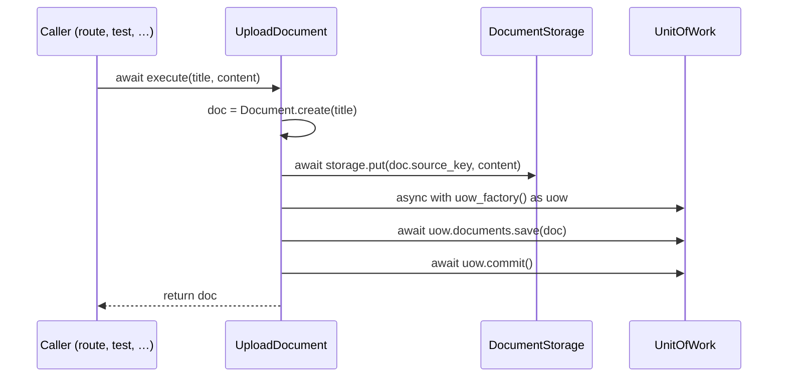

# ADR-004: Object-Storage Port and the Services Layer

**Status:** Accepted

> Builds on [ADR-001](001-hexagonal-ddd-layering.md) and
> [ADR-003](003-unit-of-work-and-repository-ports.md): the `DocumentStorage` port
> lives in `domain/`, the new services layer sits between domain and the outer
> layers, and the storage adapter depends inward on the port.

---

## Context

The first thing a user does is **upload a document**, which has two effects to
coordinate: the **file bytes** go to object storage (too large for the database,
served back later as the original), and the **metadata** (`Document`) is persisted
so the document exists in the library. This orchestration is neither domain logic
nor a transport concern — it is a **use case** — and it must reach object storage
without depending on a concrete S3 client (ADR-001). Putting upload logic in the
HTTP route calling an SDK directly would couple transport to storage and leave no
testable seam.

---

## Decision

**Introduce the `services/` layer** — use-case classes under `services/<aggregate>/`
that orchestrate the domain and its ports, sitting between `domain/` (which they
import) and the outer layers (which import them).

**Add a `DocumentStorage` port** (`domain/document/ports/`) — object storage for a
document's files, per-aggregate like `DocumentRepository`, shipping only what
upload needs (`put(key, data)`); `get` / `delete` arrive just-in-time.

**Add the `UploadDocument` use case** — dependencies as constructor params
(`uow_factory`, `storage`); `execute(title, content)` creates the `Document`,
stores the bytes, persists the metadata, returns the document. (No `content_type`
yet — only needed when the file is served back.)

**The document owns its source-file layout** via a derived `source_key`
(`documents/{id}/source`) — a pure function of identity, no new state or
transition, distinct from `content_key` (the extracted text).

**Storage first, then metadata.** The two effects are not one transaction (object
storage is not transactional with the database), so the ordering is deliberate: an
orphaned blob is harmless and garbage-collectable, whereas a committed document
whose file is missing is a user-visible failure. If storage fails, no document is
persisted. (True atomicity, if ever needed, is a transactional outbox — not
enlisting storage in the UoW.)

**Upload leaves the document `UPLOADED`** (extraction and PROCESSING are a later
slice). The import-linter contract grows to the full chain
(`domain ← services ← entrypoints`). Only an **in-memory** storage double ships
now; a real S3-compatible adapter lands later behind the same port.

---

## Consequences

- Upload behaviour is captured once, infrastructure-free, driven identically from a
  test, an HTTP route, or a CLI; the transport layer shrinks to "parse request,
  call use case", and both database and storage are swappable adapters.
- Storage-first ordering makes the only possible inconsistency a benign orphan
  blob, and `source_key` keeps the file's location a function of identity (no extra
  column to drift).
- The cost is the layering tax paid again (a route can't "just upload to S3") and
  non-atomic file+metadata writes — accepted because the ordering guarantees the
  safe direction of inconsistency; orphans are cleaned out of band.
