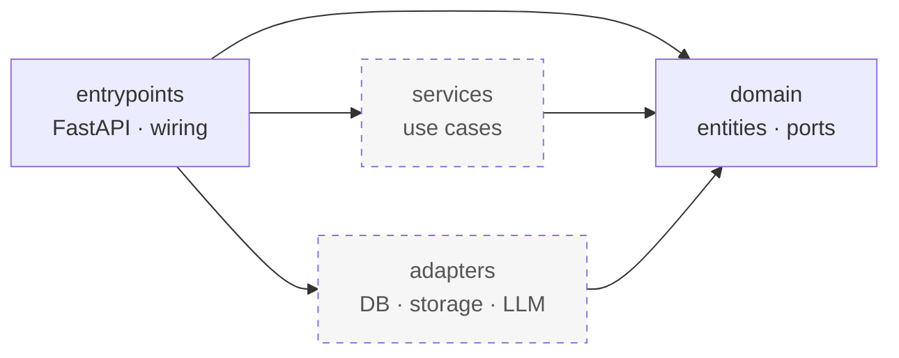
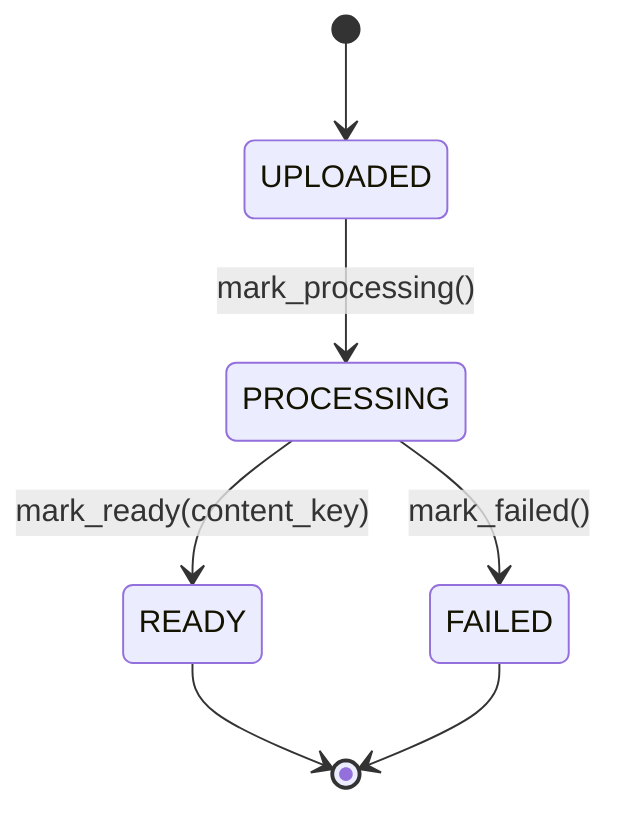

# PageMaster — Architecture

> A living map of the system. It grows as capabilities are built; detailed
> decisions live in the [Architecture Decision Records](#decision-records), each
> written when its slice lands. Anything marked **Planned** is a committed
> direction, not yet implemented — its ADR is written when that slice is built.

## What PageMaster is

A self-contained personal library that turns documents into AI-generated
summaries you can read quickly. You add documents (PDF uploads or web articles);
PageMaster extracts their text and uses it as raw material to generate concise
summaries — per chapter for a book, or a single summary for an article — and
those summaries are what you read in the app (or chat with the document about;
articles can also be turned into a podcast). The extracted text itself is never
displayed; to read a source in full you open the original PDF or link. It runs
end to end from `docker compose up` with no external services: the database and
object storage are local containers, and the AI features use mock adapters
unless a real OpenAI-compatible endpoint is configured.

## Layering

The backend is **ports-and-adapters / DDD**, dependencies pointing inward —
`domain ← services ← adapters / entrypoints` — with the rule enforced in CI by
import-linter. See **[ADR-001](adr/001-hexagonal-ddd-layering.md)** for the full
rationale and the `src/pagemaster/` layout.

Arrows mean *imports / depends on*; the rule is **outer → inner only** (`domain`
depends on nothing), enforced in CI by import-linter. Dashed nodes are
**Planned** — not built yet.

| Layer | Responsibility | Status |
|-------|----------------|--------|
| `domain/` | Entities, value objects, ports — pure Python, no infra | **Exists** (`Document`, `DocumentId`, `DocumentStatus`) |
| `services/` | One use-case class per command; owns its Unit-of-Work transaction | **Planned** |
| `adapters/` | Implements domain ports against real infra (DB, object storage, LLM) | **Planned** |
| `entrypoints/` | FastAPI app, routes, schemas, wiring | **Exists** (`GET /health`) |

## Document lifecycle

`Document` is the aggregate root. Its status is a guarded state machine —
`UPLOADED → PROCESSING → READY | FAILED` — with transitions encapsulated as
entity methods, not a free `status` setter. The `content_key` (an opaque locator
for the document's extracted text — internal raw material for summaries, not
shown to the reader) is set atomically when a document becomes READY. See
**[ADR-002](adr/002-document-status-state-machine.md)**.

## Planned capabilities

Each of these is a committed direction; its design decision is recorded in an ADR
when the slice is built test-first (so the ADR reflects real, validated code):

- **Persistence** — document metadata (including `content_key`) in Postgres.
  _ADR to follow with the persistence slice._
- **Content storage** — the extracted content bytes in object storage (Garage
  S3), keyed by `content_key`; the database stores metadata and the key, not the
  blob. _Why object storage over the database, and the key scheme: ADR to follow
  with the storage slice._
- **Extraction** — turn a source into Markdown text: PDFs in-process via
  PyMuPDF, URLs via trafilatura/Playwright. This text is internal — the input to
  summarization, never shown to the user. Drives `PROCESSING → READY/FAILED`.
  _ADR to follow with the extraction slice._
- **AI summaries (the read experience)** — the extracted text is summarized into
  what the user actually reads: per-chapter summaries for a book, a single
  summary for an article. Built on top: chat over the document (any source) and,
  **for articles only (for now)**, a generated podcast (script + audio). Mock
  adapters by default (keeping the app self-contained);
  any OpenAI-compatible endpoint pluggable (optional Ollama compose profile).
  _ADRs to follow with those slices._
- **Frontends** — an admin SPA (upload/delete/trigger jobs) and a reader SPA
  (read/notes/chat). _ADRs to follow._

## What exists today

The repository is built incrementally and test-first, so this map runs ahead of
the code on purpose. Implemented so far:

- `GET /health` and the app/CI spine.
- The `Document` aggregate: a generated `DocumentId`, a validated title, and the
  status state machine.

Everything under **Planned** above is direction, not code, yet.

## Decision records

ADRs live in [`docs/adr/`](adr/). Newest decisions reference earlier ones; none
references a decision made later.

- [ADR-001 — Hexagonal / DDD layering with a src-layout](adr/001-hexagonal-ddd-layering.md)
- [ADR-002 — Document status as a guarded state machine](adr/002-document-status-state-machine.md)
