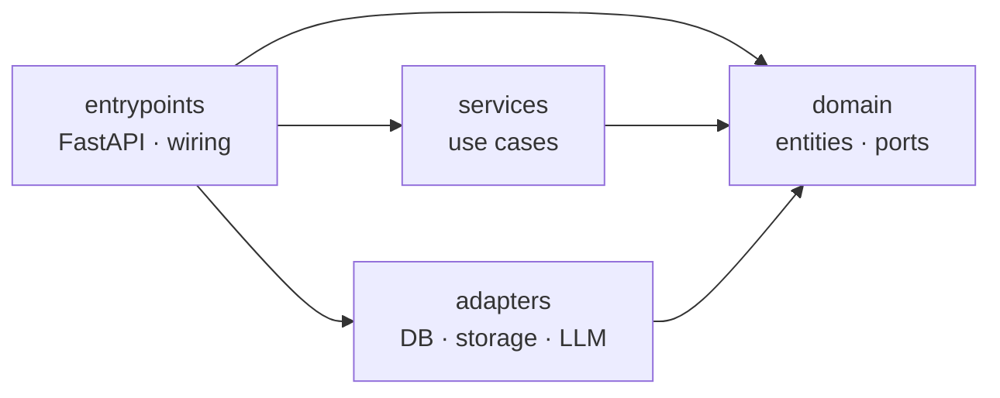
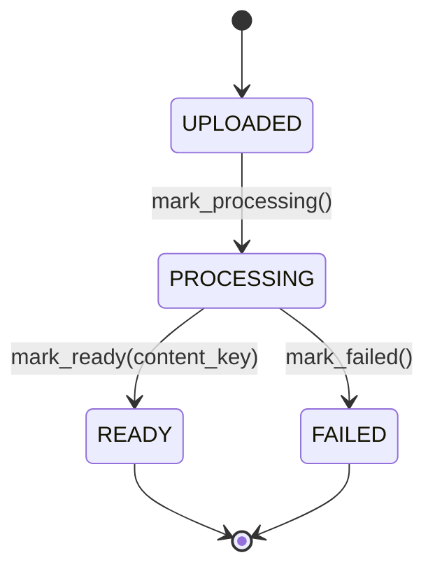
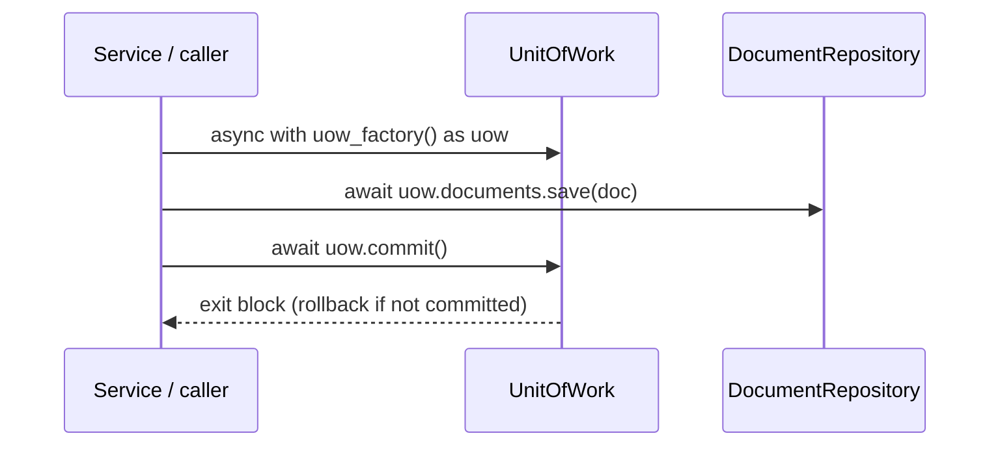
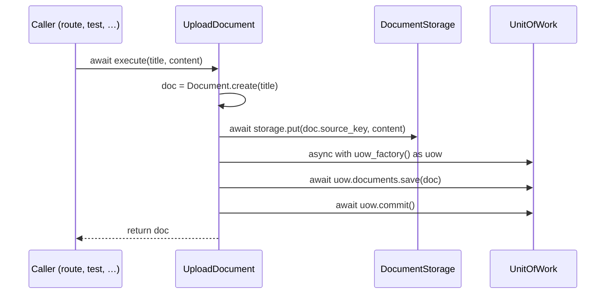
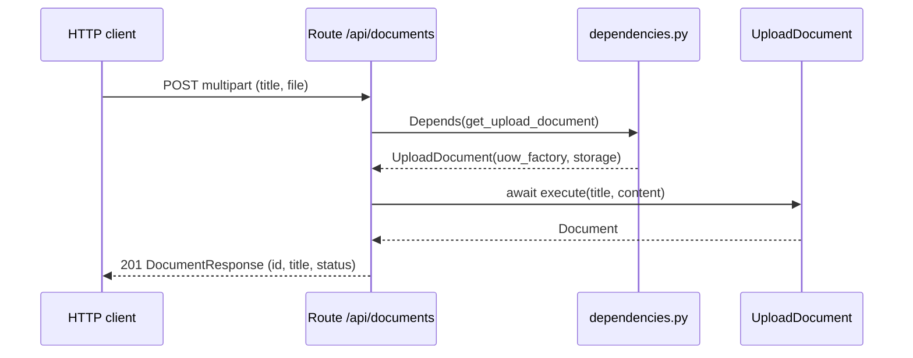

# PageMaster — Architecture

> A living map of the system. It grows as capabilities are built; detailed
> decisions live in the [Architecture Decision Records](#decision-records), each
> written when its slice lands. Anything marked **Planned** is a committed
> direction, not yet implemented — its ADR is written when that slice is built.

## What PageMaster is

A self-contained personal library that turns documents into AI-generated
summaries you can read quickly. You add documents (PDF uploads or web articles);
PageMaster extracts their text and uses it as raw material to generate concise
summaries — per chapter for a book, or a single summary for an article — and
those summaries are what you read in the app (or chat with the document about;
articles can also be turned into a podcast). The extracted text itself is never
displayed; to read a source in full you open the original PDF or link. It runs
end to end from `docker compose up` with no external services: the database and
object storage are local containers, and the AI features use mock adapters
unless a real OpenAI-compatible endpoint is configured.

## Layering

The backend is **ports-and-adapters / DDD**, dependencies pointing inward —
`domain ← services ← adapters / entrypoints` — with the rule enforced in CI by
import-linter. See **[ADR-001](adr/001-hexagonal-ddd-layering.md)** for the full
rationale and the `src/pagemaster/` layout.

Arrows are *imports*. `services` and `adapters` are independent siblings (neither
imports the other); the rule is enforced in CI by import-linter.

| Layer | Responsibility | Status |
|-------|----------------|--------|
| `domain/` | Entities, value objects, ports — pure Python, no infra | **Exists** (`Document`, `DocumentId`, `DocumentStatus`; ports `DocumentRepository`, `UnitOfWork`, `DocumentStorage`) |
| `services/` | One use-case class per command; owns its Unit-of-Work transaction | **Exists** (`UploadDocument`, `ListDocuments`) |
| `adapters/` | Implements domain ports against real infra (DB, object storage, LLM) | **Exists** (`PostgresDocumentRepository`, `SqlAlchemyUnitOfWork`, `S3DocumentStorage`; LLM to come) |
| `entrypoints/` | FastAPI app, routes, schemas, wiring | **Exists** (`GET /health`; `POST`/`GET /api/documents`) |

## Document lifecycle

`Document` is the aggregate root. Its status is a guarded state machine —
`UPLOADED → PROCESSING → READY | FAILED` — with transitions encapsulated as
entity methods, not a free `status` setter. The `content_key` (an opaque locator for
the internal extracted text, never shown to the reader) is set atomically when a
document becomes READY. See
**[ADR-002](adr/002-document-status-state-machine.md)**.

## Persistence: repositories and the Unit of Work

Persistence is reached through two domain **ports** (abstract interfaces; the
concrete adapters that implement them live outside the domain). A **repository**
is the collection for one *aggregate* — `DocumentRepository` (`save`,
`find_by_id`, `find_all`) for `Document`, under `domain/document/ports/`. The **`UnitOfWork`**
(under `domain/ports/`) is the transaction *scope*: an async context manager that
exposes one repository per aggregate (`uow.documents`, later `uow.notes` / …), so
a single block commits across all of them atomically. **Commit is explicit; any
other exit rolls back.** Services receive a `uow_factory` — a zero-arg callable
returning a fresh, unentered UoW — never a raw session. An in-memory implementation
backs unit tests; a **Postgres adapter** implements the same ports for real (below).
See **[ADR-003](adr/003-unit-of-work-and-repository-ports.md)**.

## Persisting to Postgres

The real implementation of those ports lives in the `adapters/` layer.
`SqlAlchemyUnitOfWork` wraps an async `AsyncSession` — one `async with` block is one
transaction, with the ADR-003 commit/rollback contract — and
`PostgresDocumentRepository` is `uow.documents` over that session. The domain
`Document` is persisted by **imperative mapping** declared entirely in the adapter
(`orm.py`): the entity keeps zero ORM imports (ADR-001), and a `TypeDecorator`
translates the `DocumentId` value object ↔ a UUID column. The adapter is verified
against **real Postgres in a throwaway testcontainer** — the `tests/integration/`
layer (`make integration`), re-running the ADR-003 save/fetch/rollback behaviours
unchanged, so the database is a proven swappable adapter rather than a mock. Wiring
the *running* app to Postgres (settings, engine lifespan, schema, a compose service)
is a later slice; the in-memory fake still backs the fast unit/API suite. See
**[ADR-006](adr/006-postgres-persistence-adapter.md)**.

## Storing files in object storage

The `DocumentStorage` port's real implementation is **`S3DocumentStorage`** — an
**S3-compatible** client (Garage / MinIO / AWS — endpoint-agnostic, same code for
the self-contained stack and a cloud bucket). boto3 is synchronous, so each call is
offloaded to the **anyio worker thread** to keep the event loop free; the adapter
assumes its bucket exists (provisioned out of band), as the Postgres adapter assumes
its schema does. It ships only `put` (the port's surface), proven against a **real
MinIO testcontainer** in `tests/integration/` (`make integration`) — a fresh bucket
per test, the round-trip read back through a separate client. Live wiring (endpoint,
keys, bucket from settings; a compose object-store service) is deferred to the
composition-root slice alongside Postgres. See
**[ADR-007](adr/007-s3-object-storage-adapter.md)**.

## Uploading a document

The first use case lives in the `services/` layer. **`UploadDocument`** takes a
title and the source file's bytes; it stores the file first, then commits the
metadata in a Unit of Work — the deliberate ordering ADR-004 explains. The file's
location is `Document.source_key` (`documents/{id}/source`), a pure function of
identity, distinct from `content_key` (the extracted text). Storage is reached
through a third domain port, **`DocumentStorage`** (`domain/document/ports/`,
`put` for now), in-memory in tests and an S3-compatible adapter for real (above).
Dependencies
(`uow_factory`, `storage`) arrive as constructor parameters; upload leaves the
document `UPLOADED`. See
**[ADR-004](adr/004-object-storage-port-and-services-layer.md)**.

## Exposing the use cases over HTTP

The `entrypoints/` layer puts the use cases on the wire. Routes live in an
`APIRouter` mounted under `/api` — `POST /api/documents` (a `multipart` `title` +
file upload) and `GET /api/documents` (the library list); `/health` stays
unprefixed. Each route is thin: parse the request, call the use case, map the
result to a **`DocumentResponse`** (`id`, `title`, `status`) — the wire shape that
deliberately omits the internal storage keys and extracted text. Use cases are
assembled in `dependencies.py` and injected with `Depends`; the leaf infra
providers (`uow_factory`, `storage`) are the swap point — they raise until a real
adapter lands, and tests override them with the in-memory fakes through FastAPI's
`dependency_overrides`, so the routes are verified with no infrastructure. See
**[ADR-005](adr/005-http-api-routing-schemas-and-di-seam.md)**.

## Planned capabilities

Each of these is a committed direction; its design decision is recorded in an ADR
when the slice is built test-first (so the ADR reflects real, validated code):

- **Live persistence wiring** — the Postgres adapter exists and is proven (see
  "Persisting to Postgres"); what remains is connecting it to the *running* app:
  settings/`DATABASE_URL`, an engine lifespan, schema management, and a Postgres
  service in the compose stack. Until then `get_uow_factory` stays a seam the API
  tests override with the in-memory fake. _ADR to follow with that slice._
- **Object storage** — the `DocumentStorage` port and its **S3-compatible adapter**
  both exist and store source files keyed by `source_key` (see "Storing files in
  object storage"); what remains is storing the **extracted content** keyed by
  `content_key` — the database keeps metadata and keys, never blobs — and the live
  wiring (see "Live persistence wiring", shared with Postgres). _ADRs to follow._
- **Extraction** — turn a source into Markdown text: PDFs in-process via
  PyMuPDF, URLs via trafilatura/Playwright. This text is internal — the input to
  summarization, never shown to the user. Drives `PROCESSING → READY/FAILED`.
  _ADR to follow with the extraction slice._
- **AI summaries (the read experience)** — the extracted text is summarized into
  what the user actually reads: per-chapter summaries for a book, a single
  summary for an article. Built on top: chat over the document (any source) and,
  **for articles only (for now)**, a generated podcast (script + audio). Mock
  adapters by default (keeping the app self-contained);
  any OpenAI-compatible endpoint pluggable (optional Ollama compose profile).
  _ADRs to follow with those slices._
- **Frontends** — an admin SPA (upload/delete/trigger jobs) and a reader SPA
  (read/notes/chat). _ADRs to follow._

## What exists today

The repository is built incrementally and test-first, so this map runs ahead of
the code on purpose. Implemented so far:

- `GET /health` and the app/CI spine.
- The HTTP API (the `entrypoints/` layer): `POST /api/documents` (multipart
  upload) and `GET /api/documents` (list), mapping the domain to a
  `DocumentResponse` and wiring the use cases through a dependency-injection seam
  whose infra providers are overridden in tests until the real adapters land.
- The `Document` aggregate: a generated `DocumentId`, a validated title, and the
  status state machine.
- The persistence **ports** (`DocumentRepository`, `UnitOfWork`) with two
  implementations: the in-memory fake for unit tests, and a **Postgres adapter**
  (`adapters/persistence/`, SQLAlchemy + imperative mapping) proven against a real
  database in the `tests/integration/` layer (`make integration`).
- The object-storage **port** (`DocumentStorage`) with two implementations: the
  in-memory fake for unit tests, and an **S3-compatible adapter** (`adapters/storage/`,
  boto3 in the anyio thread pool) proven against a real MinIO container in the
  `tests/integration/` layer.
- The first use cases (the `services/` layer): **`UploadDocument`**, over the
  `DocumentStorage` port — stores the source file then persists the document,
  file-first so a failure can only orphan a blob — and **`ListDocuments`**, a read
  returning every stored document via `DocumentRepository.find_all`.

Everything under **Planned** above is direction, not code, yet.

## Decision records

ADRs live in [`docs/adr/`](adr/). Newest decisions reference earlier ones; none
references a decision made later.

- [ADR-001 — Hexagonal / DDD layering with a src-layout](adr/001-hexagonal-ddd-layering.md)
- [ADR-002 — Document status as a guarded state machine](adr/002-document-status-state-machine.md)
- [ADR-003 — Unit of Work and repository ports](adr/003-unit-of-work-and-repository-ports.md)
- [ADR-004 — Object-storage port and the services layer](adr/004-object-storage-port-and-services-layer.md)
- [ADR-005 — HTTP API routing, schemas, and the DI seam](adr/005-http-api-routing-schemas-and-di-seam.md)
- [ADR-006 — Postgres persistence adapter (SQLAlchemy + testcontainers)](adr/006-postgres-persistence-adapter.md)
- [ADR-007 — S3-compatible object-storage adapter (boto3 in an anyio thread pool)](adr/007-s3-object-storage-adapter.md)
