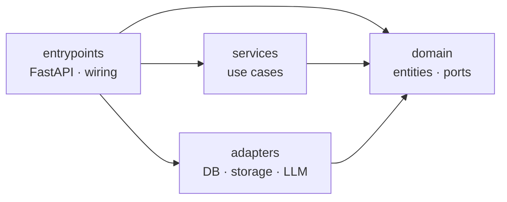
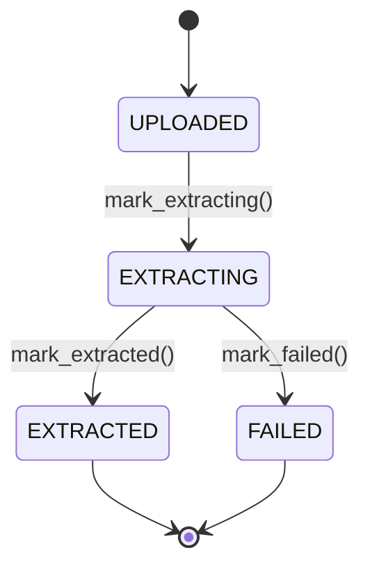
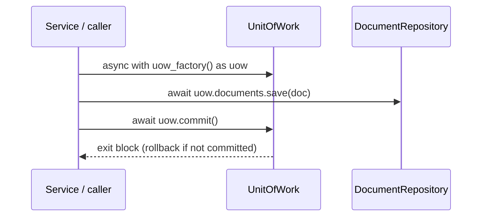
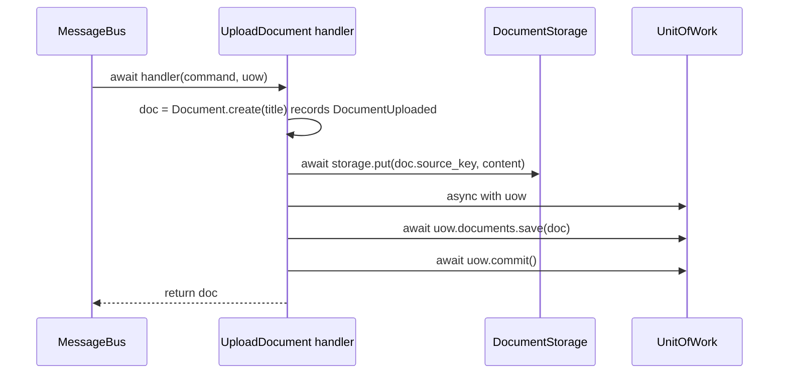
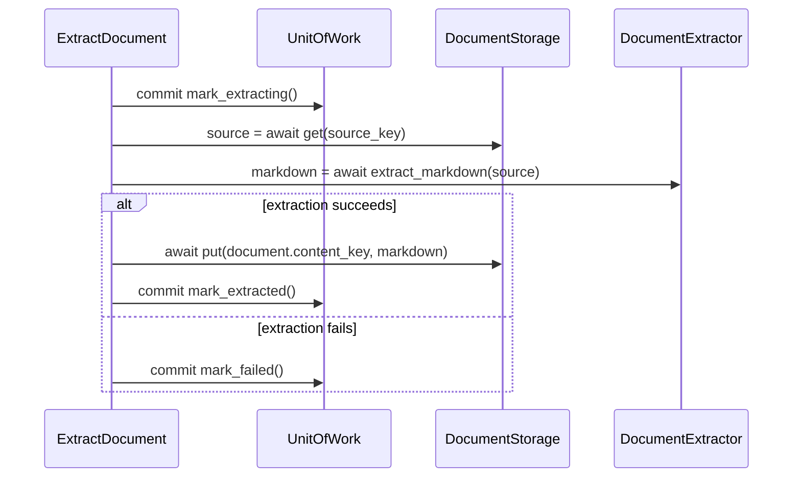
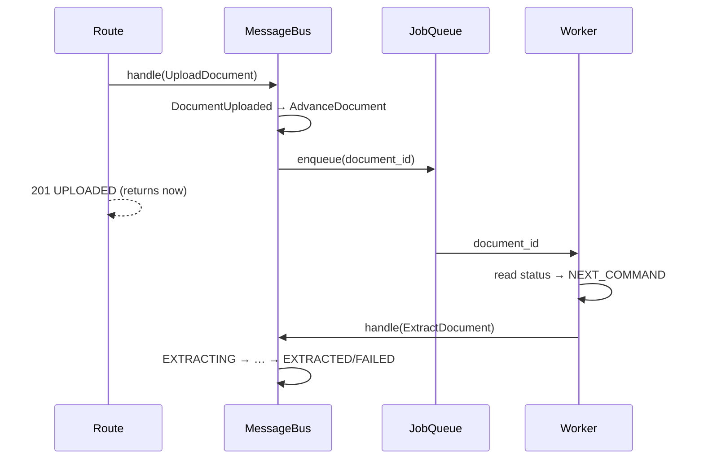
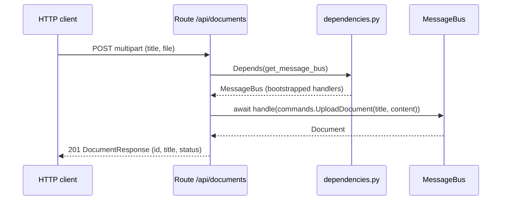
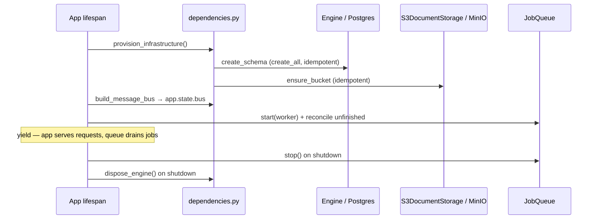

# Cicero — Architecture

> A living map of the system. It grows as capabilities are built; detailed
> decisions live in the [Architecture Decision Records](#decision-records), each
> written when its slice lands. Anything marked **Planned** is a committed
> direction, not yet implemented — its ADR is written when that slice is built.

## What Cicero is

A self-contained personal library that turns documents into AI-generated
summaries you can read quickly. You add documents (PDF uploads or web articles);
Cicero extracts their text and uses it as raw material to generate concise
summaries — per chapter for a book, or a single summary for an article — and
those summaries are what you read in the app (or chat with the document about;
articles can also be turned into a podcast). The extracted text itself is never
displayed; to read a source in full you open the original PDF or link. It runs
end to end from `docker compose up` with no external services: the database and
object storage are local containers, and the AI features use mock adapters
unless a real OpenAI-compatible endpoint is configured.

## Layering

The backend is **ports-and-adapters / DDD**, dependencies pointing inward —
`domain ← services ← adapters / entrypoints` — with the rule enforced in CI by
import-linter. See **[ADR-001](adr/001-hexagonal-ddd-layering.md)** for the full
rationale and the `src/cicero/` layout.

Arrows are *imports*. `services` and `adapters` are independent siblings (neither
imports the other); the rule is enforced in CI by import-linter.

| Layer | Responsibility | Status |
|-------|----------------|--------|
| `domain/` | Entities, value objects, ports, messages, errors — pure Python, no infra | **Exists** (`Document`, `DocumentId`, `DocumentStatus`; messages `Command`/`Event` + `Upload`/`Extract`/`List`/`Delete` commands, `DocumentEvent` base + `DocumentUploaded`/`ExtractionCompleted`/`ExtractionFailed` events; ports `DocumentRepository`, `UnitOfWork`, `DocumentStorage`, `DocumentExtractor`; `DomainError` hierarchy) |
| `services/` | Command/event handlers + the message bus that routes them | **Exists** (`MessageBus`; command handlers `UploadDocument`, `ListDocuments`, `DeleteDocument`, `ExtractDocument`; the `AdvanceDocument` event handler on `DocumentUploaded`) |
| `adapters/` | Implements domain ports against real infra (DB, object storage, extraction, LLM) | **Exists** (`PostgresDocumentRepository`, `SqlAlchemyUnitOfWork`, `S3DocumentStorage`, `PyMuPDFExtractor`; LLM to come) |
| `entrypoints/` | FastAPI app, routes, schemas, error mapping, the serial job queue, the composition root (settings, engine lifespan, startup provisioning, bus bootstrap) | **Exists** (`GET /health`; `POST`/`GET`/`DELETE /api/documents`; `JobQueue` + the `NEXT_COMMAND` stage table + restart recovery; live wiring over Postgres + S3) |

## Document lifecycle

`Document` is the aggregate root. Its status is a guarded state machine —
`UPLOADED → EXTRACTING → EXTRACTED | FAILED` — with transitions encapsulated as
entity methods, not a free `status` setter. Each member names the **pipeline stage
reached**, not readiness (ADR-014): that is what lets the edge derive the next
command from a stored status, and what lets a later stage append to the chain
instead of redefining a terminal name. The internal extracted text (an opaque
locator, never shown to the reader) exists from EXTRACTED onwards. `content_key` is not
lifecycle state — it is the identity-derived address of that text (`source_key`'s
twin), always computable, so nothing has to be set or kept in sync on transition.
See **[ADR-002](adr/002-document-status-state-machine.md)** and
**[ADR-014](adr/014-status-driven-pipeline-advance.md)**.

## Persistence: repositories and the Unit of Work

Persistence is reached through two domain **ports** (abstract interfaces; the
concrete adapters that implement them live outside the domain). A **repository**
is the collection for one *aggregate* — `DocumentRepository` (`save`,
`find_by_id`, `find_all`, `delete`) for `Document`, under `domain/document/ports/`. The **`UnitOfWork`**
(under `domain/ports/`) is the transaction *scope*: an async context manager that
exposes one repository per aggregate (`uow.documents`, later `uow.notes` / …), so
a single block commits across all of them atomically. **Commit is explicit; any
other exit rolls back.** Services receive a `uow_factory` — a zero-arg callable
returning a fresh, unentered UoW — never a raw session. An in-memory implementation
backs unit tests; a **Postgres adapter** implements the same ports for real (below).
See **[ADR-003](adr/003-unit-of-work-and-repository-ports.md)**.

## Persisting to Postgres

The real implementation of those ports lives in the `adapters/` layer.
`SqlAlchemyUnitOfWork` wraps an async `AsyncSession` — one `async with` block is one
transaction, with the ADR-003 commit/rollback contract — and
`PostgresDocumentRepository` is `uow.documents` over that session. The domain
`Document` is persisted by **imperative mapping** declared entirely in the adapter
(`orm.py`): the entity keeps zero ORM imports (ADR-001), and a `TypeDecorator`
translates the `DocumentId` value object ↔ a UUID column. The adapter is verified
against **real Postgres in a throwaway testcontainer** — the `tests/integration/`
layer (`make integration`), re-running the ADR-003 save/fetch/rollback behaviours
unchanged, so the database is a proven swappable adapter rather than a mock. The
*running* app is wired to this adapter in the composition root (see "Running the
app"); the in-memory fake still backs the fast unit/API suite. See
**[ADR-006](adr/006-postgres-persistence-adapter.md)**.

## Storing files in object storage

The `DocumentStorage` port's real implementation is **`S3DocumentStorage`** — an
**S3-compatible** client (Garage / MinIO / AWS — endpoint-agnostic, same code for
the self-contained stack and a cloud bucket). boto3 is synchronous, so each call is
offloaded to the **anyio worker thread** to keep the event loop free; the adapter
assumes its bucket exists (provisioned out of band), as the Postgres adapter assumes
its schema does. It ships `put`, `get`, and `delete` (the port's surface), proven against a **real
MinIO testcontainer** in `tests/integration/` (`make integration`) — a fresh bucket
per test, the round-trip read back through a separate client. Live wiring (endpoint,
keys, bucket from settings; the bucket provisioned at startup; a compose object-store
service) lands in the composition root (see "Running the app"). See
**[ADR-007](adr/007-s3-object-storage-adapter.md)**.

## Uploading a document

The first use case is a **command handler** in the `services/` layer.
**`UploadDocument`** handles a `commands.UploadDocument` (title + source bytes): it
stores the file first, then commits the metadata in a Unit of Work — the deliberate
ordering ADR-004 explains. The file's location is `Document.source_key`
(`documents/{id}/source`), a pure function of identity, distinct from `content_key`
(the extracted text). Storage is reached through a third domain port,
**`DocumentStorage`** (`domain/document/ports/`), in-memory in tests and an
S3-compatible adapter for real (above). Storage is injected at bootstrap; the bus
supplies the Unit of Work per call. Upload leaves the document `UPLOADED` and the
aggregate records a `DocumentUploaded` event (see "Orchestration"). See
**[ADR-004](adr/004-object-storage-port-and-services-layer.md)**.

## Orchestration: the message bus

Use cases are reached through one entry point, **`MessageBus.handle()`** (ADR-011).
A **`Command`** (imperative — `commands.UploadDocument`) is routed to exactly one
handler; an **`Event`** (a past-tense fact — `DocumentUploaded`) to zero or more.
Messages are pure data in the domain (`domain/<agg>/commands.py` + `events.py`,
bases in `domain/messages.py`). The **aggregate is the event source**: `Document`
records events off its own lifecycle (`create()` → `DocumentUploaded`; further
status methods raise `ExtractionCompleted`/`ExtractionFailed`). After each handler
the bus **drains the Unit of Work's new events** — `collect_new_events()` reads them
off the aggregates the repository has `seen` (registered by the port itself on
every accessor, delete included) — and keeps
processing until the queue empties, so one upload can fan out into a chain of
reactions. Handlers stay class-based use cases, callable as `(message, uow)`; the
composition root **bootstraps** them (injecting deps, building the command/event
maps) and hands the bus to the routes — **all four** (`UploadDocument`,
`ExtractDocument`, `ListDocuments`, `DeleteDocument`) now ride it.

The pipeline is wired as events. New messages reach the queue **only** as events the
aggregates raise — a handler never synthesises a command, so **commands enter at the
edge**. Internal reactions are event handlers: **`AdvanceDocument`** subscribes to
`DocumentUploaded` and puts the document on the job queue, so upload *causes*
extraction without the route knowing extraction exists — and without the handler
naming extraction either, since it enqueues a bare id. The command surface is now
issued from two edges — the routes (`UploadDocument`, `ListDocuments`,
`DeleteDocument`) and the **job-queue worker** (`ExtractDocument`, see "Background
jobs"). See **[ADR-011](adr/011-message-bus-commands-and-events.md)**,
**[ADR-012](adr/012-pipeline-as-events.md)**, and
**[ADR-013](adr/013-serial-job-queue-and-restart-recovery.md)**.

## Deleting a document

**`DeleteDocument`** removes a document's metadata and then its source file — the
exact mirror of upload's ordering (ADR-004): committing the delete first and
removing the blob after means the only possible inconsistency is a harmless
orphaned blob, never a metadata row pointing at a missing file. An unknown id
raises `DocumentNotFound`. `DELETE /api/documents/{id}` returns 204.

## Extracting a document

**`ExtractDocument`** is a **command handler**, issued by the job-queue worker off
the request path (see "Background jobs"), not by a route. It turns an uploaded source into the
internal Markdown that summarization will read (never shown to the reader), driving
the rest of the status machine for real: it commits `EXTRACTING` first (so the
in-flight state is observable), runs the heavy I/O outside any transaction — read
the source bytes (`DocumentStorage.get`), extract Markdown (the
**`DocumentExtractor`** port), write the result blob to `document.content_key` —
then commits `EXTRACTED`, raising `ExtractionCompleted` (the fact summaries will
subscribe to). The service never mints a storage key: `content_key` is the
document's own identity-derived address (`documents/{id}/content`). Storage-first
mirrors upload (ADR-004): the blob is written before `EXTRACTED` is committed, so an
EXTRACTED document never points at a missing content file. Extraction failure commits
`FAILED` and raises `ExtractionFailed` (status is the outcome channel); an unknown
id raises `DocumentNotFound`. The real extractor is **`PyMuPDFExtractor`**
(`pymupdf4llm`, in-process, offloaded to the anyio thread); a stub backs the unit
tests. See **[ADR-009](adr/009-content-extraction-and-the-extract-document-use-case.md)**
and **[ADR-012](adr/012-pipeline-as-events.md)**.

## Background jobs: the serial queue

Extraction (and the summaries and podcast ahead) is slow and memory-heavy, so it
runs **off the request path** on a process-wide serial **`JobQueue`**
(`entrypoints/`). Workers drain enqueued **`DocumentId` intents** with a fixed
`concurrency` (default 1 → one document at a time), so a batch upload can enqueue
freely without ever running more than N heavy jobs at once — the memory guard.

The wiring keeps commands at the edge. The `DocumentUploaded` handler
(**`AdvanceDocument`**) only enqueues an intent and names no stage; the **worker**
reads the document's persisted status back and issues the command that status calls
for — so the command is born at an entrypoint, never synthesised in a handler. Upload
returns immediately as `UPLOADED`; the document reaches `EXTRACTED`/`FAILED`
asynchronously (clients poll `GET`). The queue lives on `app.state`, created per event
loop in the lifespan.

**The pipeline's order lives in one table**, `NEXT_COMMAND` in
`entrypoints/pipeline.py`, mapping each status to the command that advances it (or to
`None` — the document is done and the intent is dropped). It is total over
`DocumentStatus`, so a new status without a decision fails a test rather than stalling
a document silently. Adding a stage therefore costs one status, one entry here, and one
subscription of `AdvanceDocument` to the preceding event — no new handler class and no
branch in the composition root.

An in-process queue loses whatever was mid-flight on a restart, so startup runs
**`reconcile_unfinished_documents`**: it re-enqueues every document whose status still
has a next stage, reconstructing the outstanding work from persisted status with no jobs
table. Because that is the *same* question ordinary dispatch asks, recovery is not a
separate path — and it also catches a document whose enqueue never happened. See
**[ADR-013](adr/013-serial-job-queue-and-restart-recovery.md)** and
**[ADR-014](adr/014-status-driven-pipeline-advance.md)**.

## Errors: the domain raises, the entrypoints map

Domain failures are a small `DomainError` hierarchy (`InvalidDocumentTitle`,
`DocumentNotFound`) raised where the rule lives; the domain never names an HTTP
status (ADR-001). A single registry in `entrypoints/errors.py` maps each to a
response — `InvalidDocumentTitle → 422`, `DocumentNotFound → 404` — so the status
codes live in one place and an unmapped domain error surfaces as 500 by design.
See **[ADR-008](adr/008-domain-exceptions-and-http-error-mapping.md)**.

## Exposing the use cases over HTTP

The `entrypoints/` layer puts the use cases on the wire. Routes live in an
`APIRouter` mounted under `/api` — `POST /api/documents` (a `multipart` `title` +
file upload), `GET /api/documents` (the library list), and
`DELETE /api/documents/{id}` (→ 204); `/health` stays
unprefixed. Each route is thin: parse the request, call the use case, map the
result to a **`DocumentResponse`** (`id`, `title`, `status`) — the wire shape that
deliberately omits the internal storage keys and extracted text. **Every route goes
through the message bus**, issuing a command (`commands.UploadDocument` /
`ListDocuments` / `DeleteDocument`); `bus.handle()` returns the originating command's
result the route serializes. Domain failures raised by the handlers are turned into
responses by the error registry (see "Errors: the domain raises, the entrypoints
map"). The bus is bootstrapped in `dependencies.py` and injected with `Depends`; the
leaf infra providers (`uow_factory`, `storage`, `extractor`) are the swap point — wired
to the real adapters in the composition root (see "Running the app"), and overridden
with the in-memory fakes in tests through FastAPI's `dependency_overrides`, so the
routes are verified with no infrastructure. See
**[ADR-005](adr/005-http-api-routing-schemas-and-di-seam.md)**.

## Running the app: the composition root

The `entrypoints/` layer is also where everything is assembled into a running
process — the composition root (`dependencies.py` + the app `lifespan`).
Configuration is read once from the environment into **`Settings`** (`pydantic-settings`:
`DATABASE_URL` + `S3_*`; no secrets in code). The root owns **one async engine per
process**, builds the real `UnitOfWork` factory and `S3DocumentStorage` from settings
— **retiring the `NotImplementedError` infra seams** — and disposes the engine on
shutdown. On **startup it provisions the infrastructure the adapters assume**:
`create_all` for the schema and `ensure_bucket()` for the object store, both
idempotent (full migrations are deferred while one app owns the schema — ADR-010).
It then **builds the process-wide message bus** (`app.state.bus`, the `get_message_bus`
seam tests swap wholesale) and **starts the job queue**, re-enqueuing any interrupted
extraction (ADR-013). The whole thing runs from `docker compose up`: Postgres + MinIO
+ the api, gated on health, zero external services. See
**[ADR-010](adr/010-composition-root-settings-and-startup-provisioning.md)** and
**[ADR-013](adr/013-serial-job-queue-and-restart-recovery.md)**.

## Planned capabilities

Each of these is a committed direction; its design decision is recorded in an ADR
when the slice is built test-first (so the ADR reflects real, validated code):

- **URL ingest** — extraction handles PDFs (see "Extracting a document"); adding a
  web article as a document (trafilatura/Playwright) extends the `DocumentExtractor`
  port when that slice lands. _ADR to follow._
- **AI summaries (the read experience)** — the extracted text is summarized into
  what the user actually reads: per-chapter summaries for a book, a single
  summary for an article. Built on top: chat over the document (any source) and,
  **for articles only (for now)**, a generated podcast (script + audio). Mock
  adapters by default (keeping the app self-contained);
  any OpenAI-compatible endpoint pluggable (optional Ollama compose profile).
  _ADRs to follow with those slices._
- **Frontends** — an admin SPA (upload/delete/trigger jobs) and a reader SPA
  (read/notes/chat). _ADRs to follow._

## What exists today

The repository is built incrementally and test-first, so this map runs ahead of
the code on purpose. Implemented so far:

- `GET /health` and the app/CI spine.
- The HTTP API (the `entrypoints/` layer): `POST /api/documents` (multipart
  upload), `GET /api/documents` (list), and `DELETE /api/documents/{id}` (204),
  mapping the domain to a `DocumentResponse`, turning `DomainError`s into HTTP
  statuses through one registry, and reaching the use cases through the message bus,
  which tests swap wholesale at the `get_message_bus` seam with a bus wired over fakes.
- The `Document` aggregate: a generated `DocumentId`, a validated title, and the
  status state machine.
- The persistence **ports** (`DocumentRepository`, `UnitOfWork`) with two
  implementations: the in-memory fake for unit tests, and a **Postgres adapter**
  (`adapters/persistence/`, SQLAlchemy + imperative mapping) proven against a real
  database in the `tests/integration/` layer (`make integration`).
- The object-storage **port** (`DocumentStorage`, `put`/`get`/`delete`) with two
  implementations: the in-memory fake for unit tests, and an **S3-compatible adapter**
  (`adapters/storage/`, boto3 in the anyio thread pool) proven against a real MinIO
  container in the `tests/integration/` layer.
- The extraction **port** (`DocumentExtractor`) with two implementations: a stub
  for unit tests, and **`PyMuPDFExtractor`** (`adapters/extraction/`, `pymupdf4llm`
  in-process) proven against a real generated PDF in the `tests/integration/` layer.
- The **message bus** (the `services/` layer): one `MessageBus.handle()` routes a
  `Command` to its single handler and an `Event` to zero or more, draining the
  Unit of Work's new events after each handler. The `Document` aggregate raises the
  events (`DocumentUploaded` on `create()`, `ExtractionCompleted`/`ExtractionFailed`
  on the outcome). Commands enter only at the edge; internal reactions are events, so
  **upload causes extraction** by `AdvanceDocument` subscribing to `DocumentUploaded`
  — no route-level coupling, and no stage named in a handler.
- The use cases (the `services/` layer): **`UploadDocument`**, over the
  `DocumentStorage` port — stores the source file then persists the document,
  file-first so a failure can only orphan a blob; **`ListDocuments`**, a read
  returning every stored document via `DocumentRepository.find_all`; and
  **`DeleteDocument`**, which removes metadata then the source blob (the mirror of
  upload's ordering) and raises `DocumentNotFound` for an unknown id — all command
  handlers reached through the bus. **`ExtractDocument`**, a command handler issued
  by the job-queue worker, drives `EXTRACTING → EXTRACTED/FAILED`, storing the extracted
  Markdown at `content_key` (file-first, like upload).
- The **serial job queue** (`entrypoints/`): a `JobQueue` drains `DocumentId` intents
  with bounded concurrency, so extraction (and the summaries/podcast ahead) runs off
  the request path — `AdvanceDocument` enqueues, and the worker derives the command
  from the document's persisted status via the `NEXT_COMMAND` table, so no handler
  names a stage. Startup `reconcile_unfinished_documents` asks that same table which
  documents a restart left unfinished, with no jobs table. Proven by an integration
  test that uploads a real PDF and polls the live app to `EXTRACTED`.
- The **composition root** (`entrypoints/`): environment-driven `Settings`, a
  per-process engine wired to the real adapters (the infra seams retired), and a
  `lifespan` that provisions the schema + bucket, builds the process-wide bus, and
  starts the job queue at startup — so `docker compose up` (api + Postgres + MinIO)
  runs the app end to end, proven by an integration test driving the live stack with
  no `dependency_overrides`.

Everything under **Planned** above is direction, not code, yet.

## Decision records

ADRs live in [`docs/adr/`](adr/). Newest decisions reference earlier ones; none
references a decision made later.

- [ADR-001 — Hexagonal / DDD layering with a src-layout](adr/001-hexagonal-ddd-layering.md)
- [ADR-002 — Document status as a guarded state machine](adr/002-document-status-state-machine.md)
- [ADR-003 — Unit of Work and repository ports](adr/003-unit-of-work-and-repository-ports.md)
- [ADR-004 — Object-storage port and the services layer](adr/004-object-storage-port-and-services-layer.md)
- [ADR-005 — HTTP API routing, schemas, and the DI seam](adr/005-http-api-routing-schemas-and-di-seam.md)
- [ADR-006 — Postgres persistence adapter (SQLAlchemy + testcontainers)](adr/006-postgres-persistence-adapter.md)
- [ADR-007 — S3-compatible object-storage adapter (boto3 in an anyio thread pool)](adr/007-s3-object-storage-adapter.md)
- [ADR-008 — Domain exceptions and domain→HTTP error mapping](adr/008-domain-exceptions-and-http-error-mapping.md)
- [ADR-009 — Content extraction (PDF → Markdown) and the ExtractDocument use case](adr/009-content-extraction-and-the-extract-document-use-case.md)
- [ADR-010 — Composition root: settings, engine lifespan, and startup provisioning](adr/010-composition-root-settings-and-startup-provisioning.md)
- [ADR-011 — Message bus: commands and events through one `bus.handle()`](adr/011-message-bus-commands-and-events.md)
- [ADR-012 — The pipeline as events](adr/012-pipeline-as-events.md)
- [ADR-013 — Serial job queue and restart recovery](adr/013-serial-job-queue-and-restart-recovery.md)
